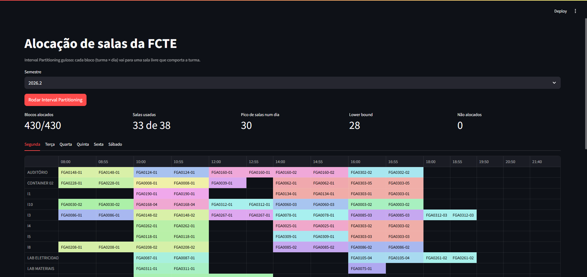
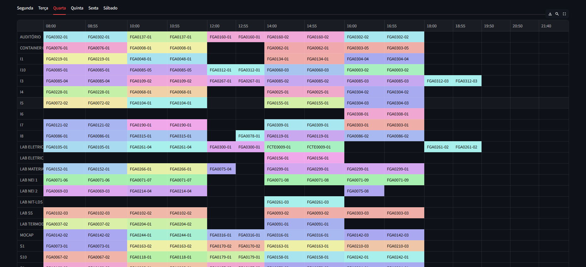
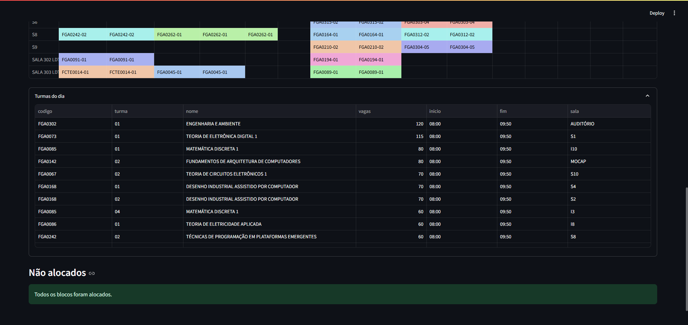

# AlocacaoSalasFCTE

**Conteúdo da Disciplina**: Greed<br>

## Alunos

|Matrícula | Aluno |
| -- | -- |
| 21/1062179  |  Marcelo de Araújo Lopes |
| 17/0020339  |  Paulo Lucca |

## Sobre

O projeto aloca as turmas de graduação da FCTE (UnB, campus Gama) nas salas do
campus sem conflito de horário, respeitando a capacidade de cada sala e usando o
menor número de salas possível. É o problema clássico de **Interval Partitioning**,
resolvido com um algoritmo guloso.

Etapas:

1. **Coleta** (`scraper.py`): busca as turmas do semestre no SIGAA público, com
   código, horário, vagas e local. Os dados de 2026.2 (229 turmas) estão salvos em
   `data/turmas_2026_2.json`.
2. **Horários** (`horario.py`): converte o código do SIGAA em intervalos. Por
   exemplo, `35T23` vira terça e quinta, das 14:00 às 15:50.
3. **Salas** (`salas.py`): extrai as 38 salas do campo "local" das turmas e salva em
   `data/salas.json`. O SIGAA não informa a capacidade, então ela é estimada pelo
   maior número de vagas ofertadas numa turma que usa aquela sala.
4. **Alocação** (`alocacao.py`): Interval Partitioning guloso, explicado abaixo.
5. **Interface** (`app.py`): app em Streamlit que roda a alocação e mostra a grade
   sala × horário de cada dia.

### Algoritmo: Interval Partitioning

Cada turma é quebrada em blocos (turma × dia de aula), e cada bloco é um intervalo
`[início, fim)`. A alocação é **por bloco**: a mesma turma pode ficar em salas
diferentes em dias diferentes, como já acontece no SIGAA.

O guloso:

1. Ordena os blocos por dia e hora de início. No empate, a turma maior vem primeiro.
2. Para cada bloco, separa as salas livres naquele horário que comportam as vagas da turma.
3. Escolhe uma sala já aberta naquele dia, se houver. Senão, abre a menor sala que serve.
4. Se nenhuma sala serve, o bloco entra no relatório de não alocados.

**Lower bound.** A profundidade `d` é o maior número de blocos acontecendo ao
mesmo tempo. Qualquer alocação precisa de pelo menos `d` salas, porque esses
blocos se sobrepõem dois a dois.

**Prova de otimalidade (caso clássico, salas sem limite de capacidade).** Suponha
que o guloso abra a sala `k` para um bloco `b`. Ele só abre uma sala nova quando
as `k − 1` salas já abertas estão ocupadas no início de `b`. Como os blocos são
processados por hora de início, cada um desses `k − 1` blocos começou antes de
`b` e ainda não terminou, então todos contêm o instante em que `b` começa. Junto
com `b`, são `k` blocos sobrepostos, logo `k ≤ d`. O guloso nunca usa mais que `d`
salas, e nenhuma solução usa menos, então ele é ótimo.

**Com capacidade**, a sala aberta pode não servir para a turma, e o guloso pode
passar de `d`.

### Resultados (2026.2)

| Métrica | Valor |
| -- | -- |
| Blocos alocados | 430 de 430 |
| Salas usadas no semestre | 33 de 38 |
| Pico de salas num dia | 30 |
| Lower bound (profundidade) | 28 |
| Sem restrição de capacidade | 28, igual ao lower bound |

## Screenshots

Métricas e grade de segunda-feira:



Grade de quarta-feira, com uma cor por disciplina:



Turmas do dia e relatório de não alocados:



## Instalação

**Linguagem**: Python 3.10+<br>
**Framework**: Streamlit<br>

```bash
git clone https://github.com/Rukkakun/G22_PA-26.2.git
cd G22_PA-26.2
pip install -r requirements.txt
```

## Uso

Abrir a interface:

```bash
streamlit run app.py
```

No navegador, escolha o semestre e clique em **Rodar Interval Partitioning**. As
abas mostram a grade de cada dia da semana.

Rodar só a alocação no terminal:

```bash
python -m alocacao data/turmas_2026_2.json
```

Coletar de novo os dados do SIGAA e regerar as salas (opcional, os dados de 2026.2
já estão no repositório):

```bash
python -m scraper --ano 2026 --periodo 2
python -m salas data/turmas_2026_2.json
```

Rodar os testes:

```bash
python -m pytest
```

## Outros

- O SIGAA público só lista o semestre corrente.
- A capacidade das salas é uma estimativa. Para corrigir uma sala, edite
  `data/salas.json` à mão.
- O algoritmo não diferencia sala de aula e laboratório.
